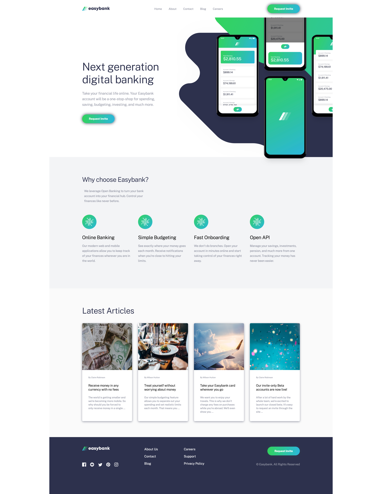

# Frontend Mentor - Easybank landing page solution

This is a solution to the [Easybank landing page challenge on Frontend Mentor](https://www.frontendmentor.io/challenges/easybank-landing-page-WaUhkoDN). Frontend Mentor challenges help you improve your coding skills by building realistic projects.

## Table of contents

- [Frontend Mentor - Easybank landing page solution](#frontend-mentor---easybank-landing-page-solution)
  - [Table of contents](#table-of-contents)
  - [Overview](#overview)
    - [The challenge](#the-challenge)
- [Screenshots 📸](#screenshots-)
  - [Desktop version 🖥️](#desktop-version-️)
  - [Grid changes:](#grid-changes)
  - [Tablet version:](#tablet-version)
  - [Mobile version📱:](#mobile-version)
    - [Links](#links)
  - [My process](#my-process)
    - [Built with](#built-with)
  - [Author](#author)

## Overview

### The challenge

Users should be able to:

- View the optimal layout for the site depending on their device's screen size
- See hover states for all interactive elements on the page

# Screenshots 📸

## Desktop version 🖥️

---

## Grid changes:

---

## Tablet version:

---

## Mobile version📱:

---

### Links

- Solution URL: [click here](https://github.com/vasilemidrigan/easy-bank-landing-page)
- Live Site URL: [click here](https://vasilemidrigan.github.io/easy-bank-landing-page/)

## My process

### Built with

- SCSS
- Semantic HTML5 markup
- CSS custom properties
- Flexbox
- CSS Grid
- Mobile-first workflow
- Native JavaScript

## Author

- Portfolio - [vasilemidrigan.github.io](https://vasilemidrigan.github.io/)
- LinkedIn - [Vasile Midrigan](https://www.linkedin.com/in/vasile-midrigan/)
- Github - [vasilemidrigan](https://github.com/vasilemidrigan)
- Frontend Mentor - [@vasilemidrigan](https://www.frontendmentor.io/profile/vasilemidrigan)
- Twitter - [@rigan004](https://twitter.com/rigan004)
